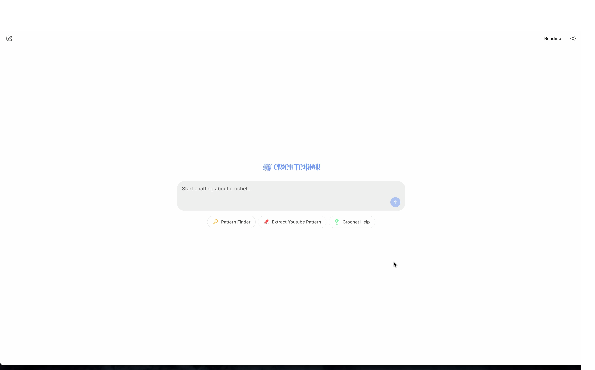
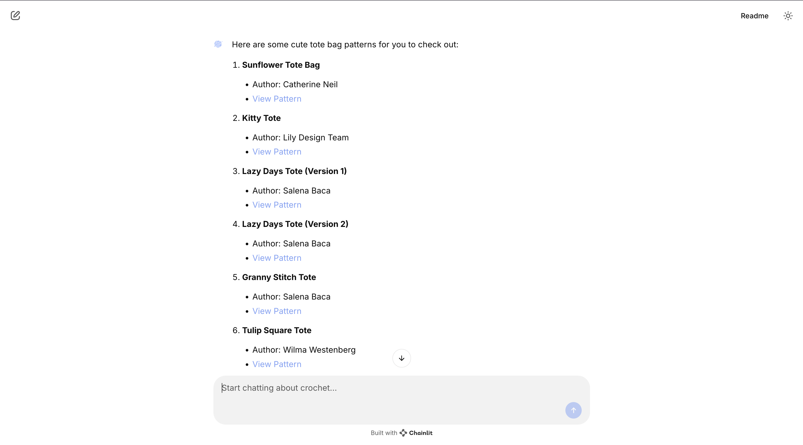
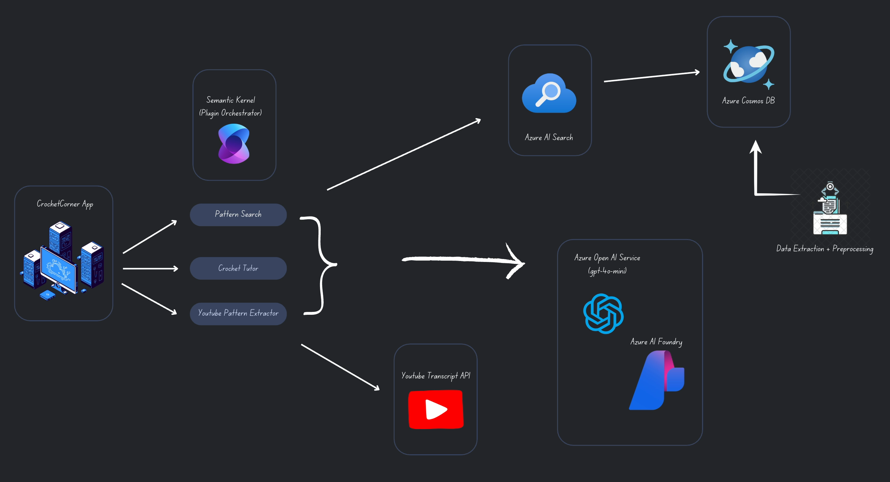

# CrochetCorner 🧶

**CrochetCorner** is an AI-agent powered assistant designed to help you **find**, **learn**, and **execute** crochet patterns with ease. Whether you're a beginner or a seasoned crocheter, CrochetCorner can make your creative process smoother, more accessible and more enjoyable.

### Why CrochetCorner?

Finding high quality crochet patterns that align with your skill level and style can be frustrating. You often have to search through:

-   Long YouTube videos
-   Outdated or confusing blog posts
-   Poorly formatted PDFs
-   Patterns mismatched to your yarn or tools

**CrochetCorner** solves this by helping you search, convert, and learn — all through one conversational intervalse.

## Key Features

### Pattern Search

Search for crochet patterns based on:

-   Project type (e.g., scarves, bags, blankets)
-   Yarn weight
-   Difficulty level
-   Style or theme
-   Author

\

---

### YouTube Pattern Transcription

Convert video tutorials into structured, readable text patterns:

-   Submit a YouTube URL
-   Automatically extract the transcript
-   Format the output into a written pattern

---

### Interactive Crochet Tutor

Receive real time crochet assistance:

-   Ask questions about stitches, techniques, or terminology
-   Get step-by-step instructions answering any confusion

## Architecture Overview

CrochetCorner is built using **Semantic Kernel**, a framework that enables dynamic orchestration of AI skills through plugins.

### Core Components

-   **PatternSearchPlugin**: Retrieves crochet patterns based on user-specified criteria.
-   **YoutubePatternExtracterPlugin**: Extracts and formats crochet instructions from YouTube videos.
-   **CrochetTutorPlugin**: Provides crochet guidance and instruction.

A central **triage agent** routes user input to the appropriate plugin using:

-   Intent recognition
-   Context management through `ChatHistoryAgentThread`
-   Function-level logging using custom filters

## Plugin Workflows

### 1. Pattern Search

**Services Used**:

-   Azure OpenAI (for understanding user input)
-   Azure Cosmos DB (for storing structured pattern data)
-   Azure AI Search (for semantic search)

**Workflow**:

1. Patterns are collected and enhanced with metadata.
2. Stored in a Cosmos DB database.
3. User input is processed and matched using semantic search.
4. Top results are returned in an easy-to-read format.

---

### 2. YouTube Pattern Extraction

**Services Used**:

-   YouTube Transcript API (to retrieve captions)
-   Azure OpenAI (to process and structure the pattern)

**Workflow**:

1. User submits a video URL.
2. Transcripts are retrieved from the video.
3. The transcript is analyzed and converted into a written crochet pattern.

---

### 3. Crochet Tutor

**Services Used**:

-   Azure OpenAI (ChatCompletion)

**Workflow**:

1. User asks a crochet-related question.
2. The assistant uses the LLM to generate a detailed, step-by-step answer based on the context and topic.
